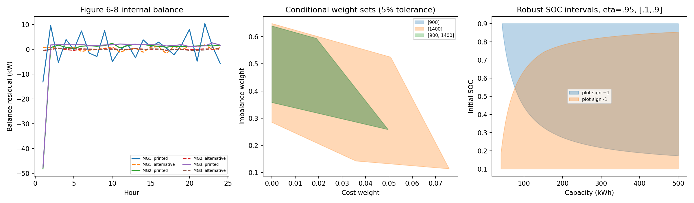

# 图5—10缺失参数反推报告

日期：2026-09-21。范围：奖励权重、电池容量、初始SOC、网络结构、PPO内循环、SOC公式及Critic更新符号。

## 结论

**可以得到条件范围和排除证据，不能由这些图唯一恢复作者配置。** 本轮完成数字化、约束求解、可辨识性反例和前向验证，没有重训或改写原实验。最重要的新证据是：图6—8的数值更接近“图中电池功率正值表示充电、总发电量乘0.99”的平衡关系，与正文的正值放电及0.02网损存在冲突。应先解决这一冲突，再用奖励曲线估计超参数。

| 目标 | 本次反推结论 | 证据强度与条件 |
|---|---|---|
| 奖励权重 | 同阶段日指标配对下，约 `0≤w_C≤0.0497`、`0.2579≤w_de≤0.6392`；不是任意组合均可行 | 读图误差加5%奖励配对容差；仅必要约束，不是置信区间或作者值 |
| 电池容量 | 没有唯一值，也没有可由功率轨迹确定的有限上界；100 kWh可行 | 须给定效率、SOC范围和功率符号；下文给出下界 |
| 初始SOC | 100 kWh、效率0.95、SOC限值[0.1,0.9]时：正文符号可行区间约[0.441,0.900]，反向符号约[0.100,0.641] | 三MG共用容量/初态，并要求覆盖全部读图误差；0.5同时满足两种解释 |
| 网络结构 | 无法反推出64×64或其他唯一结构 | 不同宽度Tanh网络可输出完全相同的策略；图中未提供权重形状或参数量 |
| PPO内循环 | 无法反推出epoch、minibatch和clip；4轮、全批24、clip=0.2仍只是原工程假设 | Algorithm 2没有明确内循环；单次更新时多个clip给出相同梯度 |
| SOC公式 | 物理实现应区分放电除效率、充电乘效率；但作者实际功率符号/分支无法确认 | 图内平衡支持反向绘图符号；错误交换物理分支可导致往返能量增益 |
| Critic符号 | 式27的非负平方误差应最小化；以普通下降优化器实现时不应对该误差做梯度上升 | 数学方向明确；作者是否优化负损失、是否停止TD目标梯度仍不可由图确定 |

若必须选一组**后续验证用候选**，可取 `w_C=0.02、w_de=0.45、C=100 kWh、SOC0=0.5`；网络和PPO设置暂保留原工程假设。此组合仅通过部分逆问题必要条件和电池可行性检查，**尚未训练验证，也不是推荐的最优配置或恢复出的作者参数**。另外两组权重 `(0.01,0.50)`、`(0.03,0.40)`也通过同样约束，已经说明解不唯一。不能把当前实验改成这些数值后直接宣称严格复现。



## 1. 数据依据与误差

依据根目录原论文，印刷页5905的式6—8、5906的式16—18、5908的式23—29与Algorithm 2、5909的实验设置、5910—5911的图5—9及表I/II。对象是三个修改后的ORNL微电网；方法是本地Actor-Critic PPO与联邦参数平均；论文以奖励、24小时调度和成本/失衡指标说明方法效果。本分析仅检验这些公开证据能支持哪些配置推断。

从PDF提取嵌入原图，生成[72条逐小时参考数据](reference_digitized/inverse/schedule_reference.csv)与[54个图9指标读数](reference_digitized/inverse/fig09_reference.csv)。全部是图像读数，不是作者原始实验数据。图6—8横轴0映射到表II第1小时，上下图横向边距分别校准。图9圆形标记有局部遮挡，采用原始分辨率下的轮廓中心；没有把颜色区域的偏移中位数当作完整标记中心。

读图容差预先设为CG ±0.5 kW、BA ±0.15 kW、失衡 ±1 kW；图9失衡 ±50 kW、成本各±500美元。容差是工程估计，未由作者原始数据校准。报告小数用于复算，不能理解成测量精度。原图、像素校准和诊断协议见[参考目录](reference_digitized/inverse/protocol.md)。本轮没有取得作者代码或新增外部原始数据。

## 2. 先检查图表能否联立

### 2.1 电池符号与网损线索

令图上电池值为 `B_plot`，`G=P_CG+P_wind+P_PV`。正文式11、17要求：

`U = 0.98 × (G + B_plot) - load`。

图内数据则更接近：

`U = 0.99 × (G - B_plot) - load`。

| MG | 正文公式RMSE / kW | 反向BA、网损0.01的RMSE / kW |
|---|---:|---:|
| 1 | 5.523 | 0.896 |
| 2 | 9.935 | 0.227 |
| 3 | 9.905 | 0.256 |

候选检查覆盖两种符号和三种网损值0、0.01、0.02，结果见[全部18项比较](evidence/inverse_parameters/balance_hypotheses.csv)。自由拟合 `U+load=αG+βB_plot` 时，MG2的 `(α,β)` 约为 `(0.990,-1.014)`，MG3约为 `(0.990,-1.010)`。MG1偏差较大，仍不能称0.01解释完全一致：其中2个小时超出本次读图合成容差。更不能凭这组读图值断言三个网损系数分别都等于0.01，或证明作者代码采用了这组数值。

最明显的证据在MG2/3首小时：图中BA约为+25 kW，按正文放电解释，失衡计算比柱图高约48 kW；反向解释消除了这个差额的大部分。该信号独立于奖励权重和神经网络，因此不能靠增加PPO轮数解决。

这是完成预定平衡检查后发现的诊断分支，未回写表I/II、环境公式或训练输出。噪声场景、绘图符号、网损实现或未公开输入均可能参与形成差异；当前证据只能排序这些解释的相容程度。

### 2.2 调度图与图9不宜当作相同轨迹

将图6的CG读数直接代入表I的二次成本，得到MG1日CG成本约**23376美元**；图9第1400次约**36039美元**。图6失衡绝对值逐时求和约4656，图9末期约3062。该差异远大于本次读图容差，且CG成本与容量、初始SOC、奖励权重都无关，无法通过调整这些参数消除。

此外，图7/8的电池轨迹相近，首小时约25 kW，其后约零；图9末期MG2、MG3的BA日成本却分别约3000和22625美元。若额外假定两MG采用同一容量/初态、效率0.95、SOC∈[0,1]、动作前SOC计费，以及这些图对应同一调度，则可界定BA成本差：

`|C_BA,3 - C_BA,2| ≤ 24×66 + 12.66 Σ |z3-z2|`，其中 `z=P_BA+150(1-SOC)`。

用逐步SOC差值界和首步能量所要求的必要容量下界，得到最大成本差约10035美元（正文符号）或10558美元（反向符号），已覆盖功率读图误差。图9读出的差约19625美元，即使扣除1000美元成本读图容差仍超过该上界。详见[成本差界](evidence/inverse_parameters/battery_cost_consistency_bound.json)。这排除的是“同一调度、共同电池参数及上述公式口径”的联合解释，不排除MG采用不同参数，也不证明某一张图造假。

## 3. 奖励权重：条件可行域

若图5为24小时原始奖励之和，式16给出：

`Y=-R = w_C A + w_de B`，

`A=Σ(C_CG+C_BA)`，`B=Σ price_t × |P_de,t|`。

图9只给出了未加权的 `D=Σ|P_de|`（此汇总本身也是解释），没有逐小时失衡分布。不能令 `B=D`，也不能擅自用平均电价精确替代。表II仅允许必要界：

`8.10 D ≤ B ≤ 27.35 D`。

对每个MG构造带读图容差的不等式，取两个权重各自属于[0,1]。论文没有要求 `w_C+w_de=1`。配对采用：图9第900次与图5第二阶段标签（MG1/2/3分别956/942/938次）以及图9第1400次与第三阶段标签（1328/1437/1406次）。**这些不是同迭代观测**，因此分别计算0%、5%、20%的奖励配对容差，不把某个容差宣称为统计置信度。

| 使用数据 | 配对容差 | w_C投影区间 | w_de投影区间 |
|---|---:|---:|---:|
| 第二、三阶段共同约束 | 0% | [0,0.0433] | [0.2895,0.6088] |
| 第二、三阶段共同约束 | 5% | [0,0.0497] | [0.2579,0.6392] |
| 第二、三阶段共同约束 | 20% | [0,0.0689] | [0.1631,0.7305] |
| 仅第三阶段 | 5% | [0,0.0758] | [0.1135,0.6482] |

这些是二维多边形的**坐标投影**，不可把两个区间任意组合。5%共同约束多边形顶点约为 `(0,0.35755)`、`(0.04972,0.25788)`、`(0.01904,0.59347)`、`(0,0.63921)`。所有约束、阶段单独结果和顶点保存在[权重可行域](evidence/inverse_parameters/reward_weight_regions.json)。这些约束仅使用价格极值放松了逐小时可实现性，落在区域内还不足以证明存在匹配论文的策略。

例如MG2第二阶段，图9两项成本和约51504美元，而图5奖励绝对值约3525美元；若成本权重0.5，仅成本项已远超总惩罚，因此 `(0.5,0.5)` 在这个配对解释下被排除。它不等于“已经证明作者权重必定很小”：若奖励使用其他缩放、平均口径或不同轨迹，上述推断就必须重新建立。

若进一步假定MG1图6是完全信息、每小时可独立优化的内点解，式16的一阶条件给出：

`w_de/w_C = (2a_CG P_CG+b_CG)/(0.98 price_grid)`。

24小时得到约0.297—1.022，不存在覆盖全部小时的同一比值；CG ±0.5 kW只引起约0.0003—0.0010的比值误差。不能挑一小时得出固定比值。该一阶条件额外假定很强，部分可观测策略、跨小时状态依赖和非最优策略均可能使其失效；它用于否定简单反推路径，不用于证明论文算法有误。

## 4. 电池容量与初始SOC：联合可行域

采用物理上正功率放电的约定，效率均为η，1小时步长：

`h_t = P_t/η (P_t≥0)，否则 h_t=ηP_t`；

`H_t=0.998 H_(t-1)+h_t，H_0=0`；

`SOC_t=0.998^t SOC_0-H_t/C`。

令初始能量 `E0=C SOC0`，则所有时刻可行性是关于 `(C,E0)` 的线性约束：

`SOC_min C ≤ 0.998^t E0-H_t ≤ SOC_max C`。

这通常提供下界和SOC区间，无法唯一决定C；更大的容量可以产生相同外部功率轨迹。以下假定三个MG使用同一容量和初态（论文未确认），η=0.95、SOC0=0.5，联合使用72个小时点：

| 图上BA符号解释 | SOC限值 | 按中心读数最小容量 / kWh | 覆盖每点±0.15 kW误差的最小容量 / kWh |
|---|---|---:|---:|
| 正值放电，正文解释 | [0,1] | 59.46 | 67.20 |
| 正值放电，正文解释 | [0.1,0.9] | 75.25 | 85.05 |
| 正值充电，图内平衡更支持 | [0,1] | 48.78 | 55.19 |
| 正值充电，图内平衡更支持 | [0.1,0.9] | 60.30 | 68.23 |

右列要求所有允许的读图误差序列都可行，是保守充分保证，**不能把85.05或68.23当作作者容量必定超过的无条件下界**。50 kWh在反向符号、[0,1]、中心读数下可行，但不能覆盖全部读图误差；100 kWh则在两种符号、[0.1,0.9]下都可行。

固定C=100 kWh、η=0.95、[0.1,0.9]并覆盖读图误差时，正文符号要求SOC0约[0.4409,0.9]，反向符号要求约[0.1,0.6412]。因此原来的SOC0=0.5没有被轨迹可行性排除，却也不能确认是作者值。完整计算还覆盖效率1、初态0.3/0.7以及容量50/200/500：[容量下界](evidence/inverse_parameters/capacity_lower_bounds.csv)、[初始SOC区间](evidence/inverse_parameters/initial_soc_intervals.csv)。

“第一小时25 kW，此后近零”不等于电池耗尽。如果另外**假定**首步放电恰好到下限，才有 `C=P1/[η(0.998 SOC0-SOCmin)]`；若首步是充电到上限，则是 `C=ηP1/[SOCmax-0.998 SOC0]`。图中没有SOC或饱和标志，故这两式都只能产生一族条件解，不能直接定为50 kWh。

## 5. 网络与PPO内循环：为何图表不足以辨识

**网络。** 式12提供输入状态定义，动作式13在当前三MG各一个CG/BA的模型中对应两个控制量，Critic输出一个价值；但隐藏层数、层宽、激活、Actor/Critic是否共享骨干、动作方差处理均未公开。不能由平滑曲线判断用了两层64。

可构造明确反例：复制一个Tanh隐藏单元，将其到输出层的权重分成两半，网络宽度由8变9，而所有输入上的函数保持相同。脚本用100个五维输入复核，两网络最大输出差为8.9×10^-16。该代数恒等式不限于这100点；数值检查仅验证实现。最终策略输出甚至全部已知，也不足以从函数唯一确定网络宽度，更不用说仅有几条奖励曲线。网络权重本身还存在隐藏单元置换等不唯一性。

**PPO。** 论文明确1500次本地迭代、500次聚合、γ=0.99、λ=0.95和学习率；Algorithm 2每次采样后列出一次Actor与Critic更新，没有明确给出对同批数据反复优化的循环。因而“一次采样、一次更新”是最少附加假设的字面解释，但也不是已证实的作者实现。24小时调度不能自动证明每次迭代只有一条24步轨迹。

一个可验证的不可辨识例子：新旧策略相同时比率r=1。若每批仅做一次Actor更新，clip=0.1/0.2/0.3在r=1处给出相同目标梯度。脚本三次计算得到完全相同梯度 `[-2/3,1/6,1/2]`。多轮更新是否发生、batch/minibatch大小、终止bootstrap、优势归一化、KL提前停止等，无法从曲线的“收敛约几百次”分离；样本数、网络初始化和奖励尺度也会改变收敛速度。

因此，本轮不将64×64 Tanh、clip=0.2、4轮、batch=24提升为“反推参数”。它们保持工程假设身份。增加训练试验只能比较候选的预测相容性，不能据相似曲线证明作者使用过该配置。

## 6. 两个公式歧义的处理

### SOC效率与分支

当P是电池接入母线的功率且正值放电时，物理一致解释为：

`SOC_next=(1-δ)SOC-PΔt/(η_discharge C)`，P≥0；

`SOC_next=(1-δ)SOC-η_charge PΔt/C`，P<0。

论文式6分母却标为η_ch，式7乘子标为η_dch；正文没有清楚把式号与功率分支逐项对应。若仅交换效率下标且两效率相同，数值无法分辨；若把“除效率”真正用在充电、把“乘效率”用在放电，会产生不合理的能量增益。忽略自放电时，η=0.95的正确往返能量比是0.9025，错误分支是1.1080。

图内平衡又提示图上BA符号可能反了。必须先决定图值到物理功率P的转换，不能一边按正值放电更新SOC、一边按正值充电计算失衡。当前原实验继续保留已声明的物理解释；报告中的反向分支只是诊断。

### Critic更新方向与TD目标

式27为非负平方TD误差。对该函数本身做梯度上升通常增大误差，和最小化Bellman误差的目标相反。例：固定目标y=10、V=0、学习率0.001，损失100；下降一步后99.6004，上升一步后100.4004。一般可由 `L(μ+η∇L)=L(μ)+η||∇L||²+O(η²)` 判断局部方向。

因此合理实现应最小化式27，或等价地对“负平方误差”做上升。式29的加号无法证明作者实际使用错误的上升；可能是符号笔误或未写出的负损失约定。Actor式23是最大化目标，它的加号不能照搬到正的Critic平方损失。

是否把 `r+γV(s')` 停止梯度属于另一个未披露设置。固定目标半梯度TD与对完整Bellman残差求梯度不是同一更新；本轮只证明优化方向，未声称从奖励曲线辨识出作者的detach设置。

## 7. 验证与可复算交付

执行环境为 `F:\Blackma\Anaconda\envs\pytorch_env\python.exe`，PyTorch 2.4.1、NumPy 2.2.6、SciPy 1.15.3。执行命令：

```powershell
& 'F:\Blackma\Anaconda\envs\pytorch_env\python.exe' -X utf8 scripts/digitize_inverse.py
& 'F:\Blackma\Anaconda\envs\pytorch_env\python.exe' -X utf8 scripts/infer_missing_parameters.py
```

64项容量边界组合均经过独立逐步SOC递推验证，并检查容量再降低0.1%后对应约束问题不可行。Critic方向、等价网络和PPO首步梯度反例均实际计算。与原交付SHA256清单比较，503个受保护原实验文件哈希一致；没有覆盖主配置、模型、日志和六图。见[分析审计](evidence/inverse_parameters/analysis_audit.json)、[不可辨识性证据](evidence/inverse_parameters/identifiability_checks.json)、[来源清单](evidence/inverse_parameters/analysis_manifest.json)。

后续若要进一步缩小参数集合，最有用的新增观测依次是：同一检查点的逐小时CG/BA/SOC和奖励分解；网损与电池符号的作者实现；网络state_dict形状；PPO每次迭代的采样数、优化器步数、clip及minibatch设置。仅增加相似曲线或挑选随机种子不能补齐这些信息。

本轮完成的是这七项参数/歧义的反推分析，结论包含可行集合、排除条件和不可辨识性。**作者原始参数没有被唯一恢复，原图5—10严格数值复现仍未通过。**
